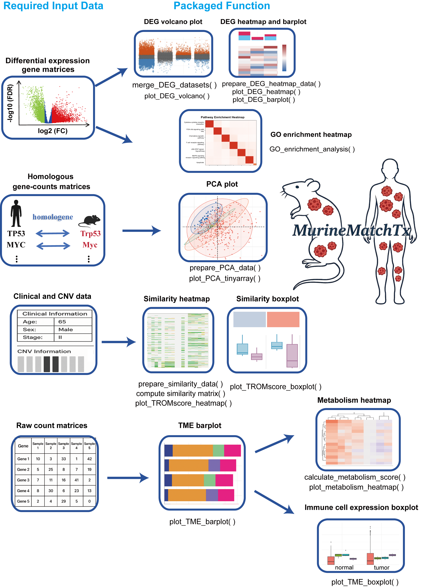

# MurineMatchTx

## 1. Introduction

**MurineMatchTx** is an R package designed to address a central challenge in translational cancer research: quantitatively evaluating the **transcriptional similarity between mouse models and human cancer samples**. It provides a streamlined pipeline for cross-species integration of RNA-seq data, enabling researchers to assess the fidelity of preclinical models in mimicking human tumor biology.

By integrating DEG analysis, PCA, TROM scoring, immune profiling, and GO enrichment in a unified workflow, MurineMatchTx helps researchers systematically identify **which mouse models best resemble human tumor subtypes** at the transcriptomic level.

### MurineMatchTx package workflow



---

## 2. Installation

You can install the package directly from GitHub:

```r
# Install devtools if necessary
if (!require("devtools")) install.packages("devtools")

# Install the package
devtools::install_github("wangdian-PKU/MurineMatchTx")
```

---

## 3. User Manual

Detailed guidance of how to use MurineMatchTx could be found in the https://wangdian-pku.github.io/MurineMatchTxManual/.

---

## 4. Contact us

We are always open to your questions and encourage discussions here.

You can report potential bugs to the [issues](https://github.com/wangdian-PKU/MurineMatchTx/issues).

Any question can directly contact the author by email: wangdian@bjmu.edu.cn
